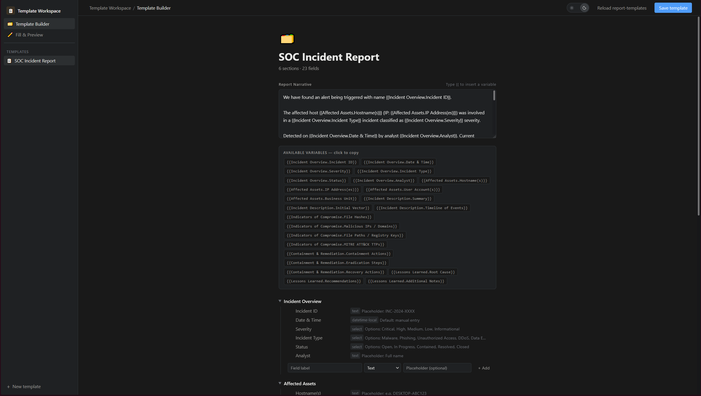
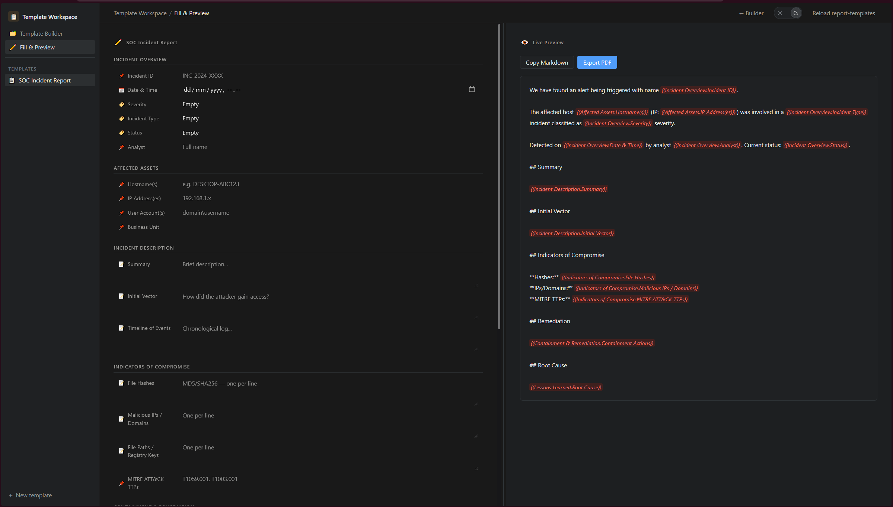

# Template Workspace

A desktop template editor built with Go, Wails v2, and a local HTML/CSS/JS UI. It stores templates as individual JSON files and exports filled reports to PDF.

## Screenshots

### Template Builder



### Fill & Preview



## Install

Install Go 1.25+ and the Wails CLI:

```bash
go install github.com/wailsapp/wails/v2/cmd/wails@v2.13.0
```

## Run Desktop App

```bash
wails dev
```

## Local Packaging

Build a local package for the current platform with:

```bash
wails build
```

The platform binary is written to `build/bin/`.

Official releases are tag-driven:

```bash
git tag v1.0.0
git push origin v1.0.0
```

The GitHub Actions workflow builds Windows, Linux, and macOS artifacts on native runners and publishes them directly to the GitHub Release for that tag.

Manual `workflow_dispatch` runs are also supported for snapshot testing without publishing a GitHub Release.

## Packaging Layout

Wails builds a native application using the platform WebView. The `wails.json` file is the packaging configuration.

## Project Layout

- `main.go`: Wails desktop entrypoint and embedded frontend assets
- `app.go`: template persistence, JS bridge, and PDF export
- `web/`: frontend loaded inside the desktop window
- `web/Report-Template-builder.html`: app markup
- `web/Report-Template-builder.css`: app styles
- `web/Report-Template-builder.js`: app logic and desktop bridge calls
- `report-templates/`: saved template JSON files
- `go.mod`: Go and Wails dependencies
- `wails.json`: Wails build configuration
- `.github/workflows/release.yml`: GitHub Actions release workflow

## Features

- Build templates with editable sections, fields, placeholders, select options, and date defaults
- Reorder sections and fields with drag and drop
- Duplicate templates from the sidebar
- Inline-edit field labels, field types, placeholders, select options, and date defaults
- Fill templates and see a live preview
- Copy the rendered report as Markdown or export it to PDF
- Sort templates by recent, `A-Z`, or `Z-A`
- Autosave template changes through the Go desktop bridge and browser cache
- Launch without a local web server or browser tab

## Keyboard Shortcuts

- `Ctrl/Cmd + S`: save the current template
- `Ctrl/Cmd + Shift + D`: duplicate the current template
- `Ctrl/Cmd + 1`: switch to Template Builder
- `Ctrl/Cmd + 2`: switch to Fill & Preview

## Templates

Templates are stored as individual `.json` files in `report-templates/`.

The desktop app keeps this storage model unchanged:

- one template per file
- filenames generated from the current template name on save
- duplicate IDs skipped with warnings
- atomic writes when saving

Example manual template:

```json
{
  "id": "incident-report",
  "name": "Incident Report",
  "narrative": "Title: {{Overview.Title}}",
  "sections": [
    {
      "name": "Overview",
      "open": true,
      "fields": [
        {
          "label": "Title",
          "type": "text",
          "placeholder": ""
        }
      ]
    }
  ]
}
```

If `id` is missing, the desktop app will generate one from the filename on load.

## Notes

- Use `Reload Templates` after manually adding or editing template files.
- The packaged desktop app reads/writes `report-templates/` next to the executable.
- Bundled starter templates are copied into the executable-adjacent `report-templates/` folder on first launch if needed.
- Windows stays `onedir` because startup is faster than a self-extracting `onefile` executable.
